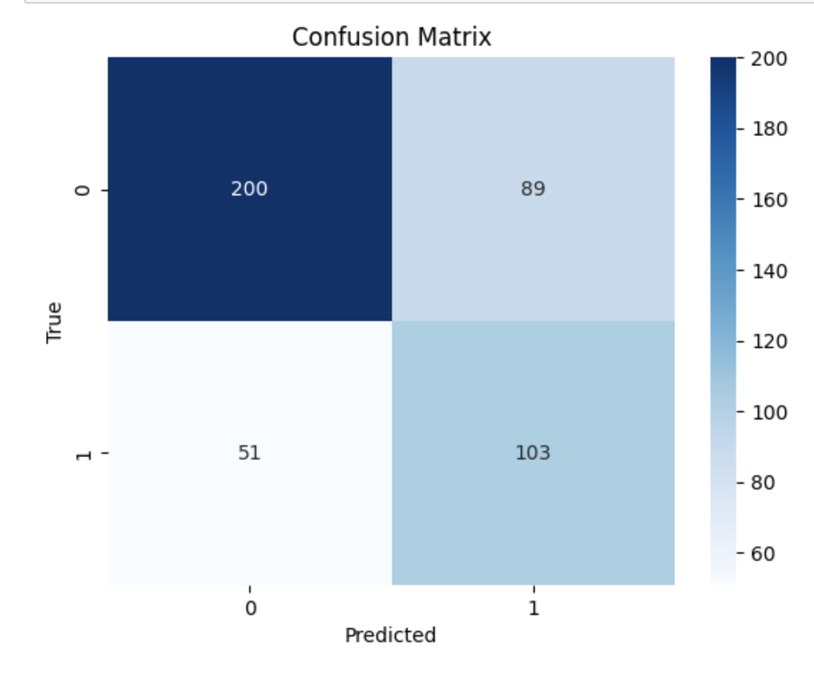
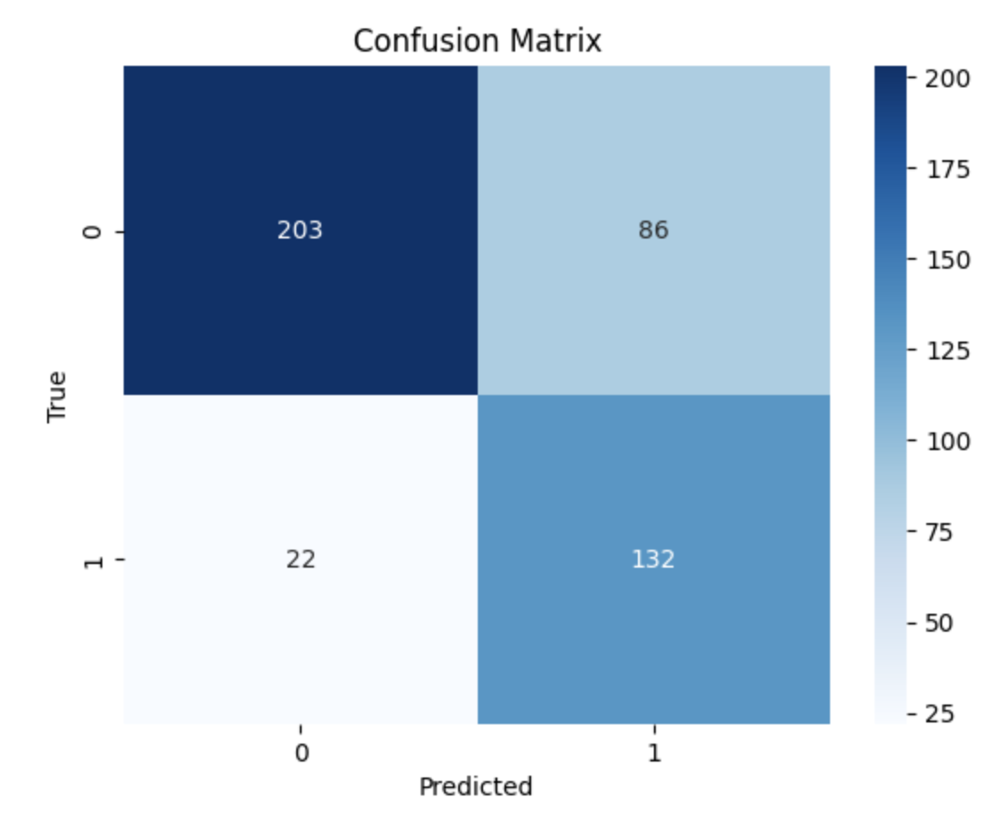
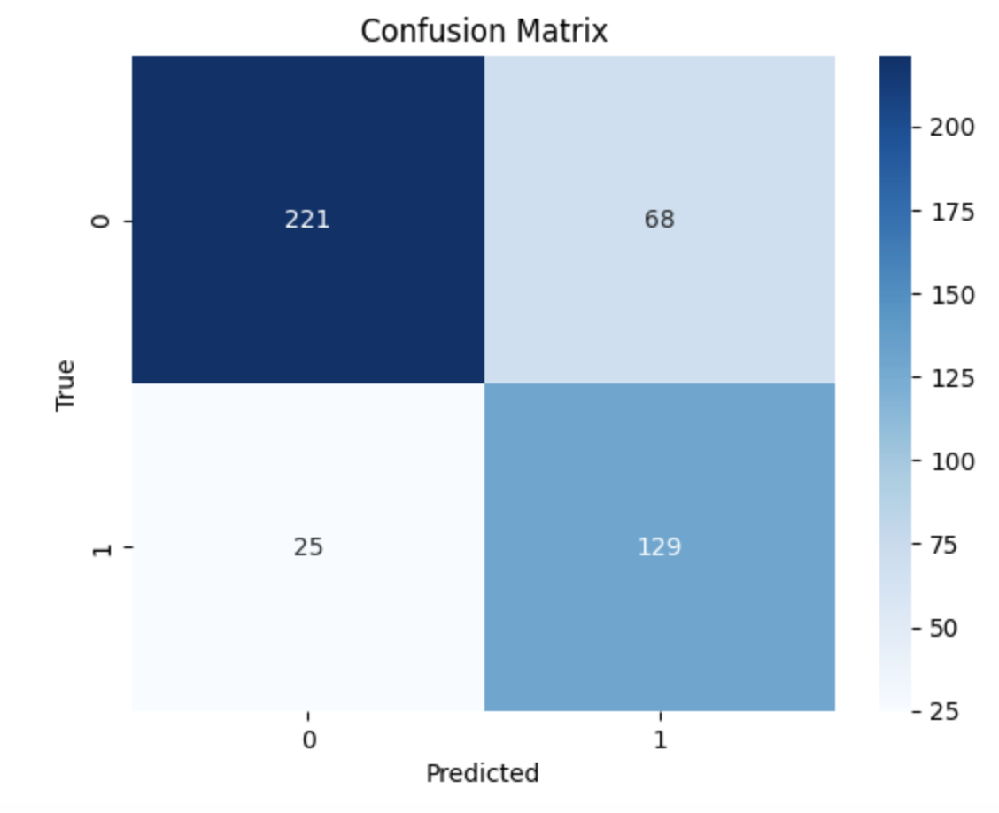

# PowerOutageClassifier
**Authors**: Yihuan Wang, Jiayi Zhu
## Project Overview
This is a data science project investigating the causes of power outages.

The dataset used in this study is obtained from Purdue University's laboratory and is titled "Major Power Outage Risks in the U.S.". It comprises 1,534 records, each representing a power outage event in the United States, and includes 55 columns. Building upon the data analysis we have done [previously](https://yhw086.github.io/PowerOutageAnalysis/), we have slightly modified our data cleaning process for this project. We have converted the `xlsx` file into `csv` file and drop unnecessary rows and columns. Details will be included below.  

The dataset used to investigate the topic can be found [here](https://www.sciencedirect.com/science/article/pii/S2352340918307182#s0015). This project is for DSC80 at UCSD.

---
## Framing Investigation Problem
Our project aims to predict the likelihood of power outages being caused by severe weather conditions. Utilizing a two-phase model approach, we start with a base model employing features like `Climate.region`, `Res.sales`, and `Outage.duration`. These features are readily available and provide an initial framework for prediction. As we progress to our final model, we improve by including additional variables such as `U.s._state` and `Customers.affected`, aiming to enhance the precision of our predictions. The underlying hypothesis is that severe weather significantly impacts the incidence and severity of power outages. Our project aims to identify key patterns and factors specific to weather-induced power disruptions. This could have far-reaching implications for emergency response planning, infrastructure resilience enhancement, and policy-making in the energy sector.

### Binary classification Problem

Our project is designed to predict, power outages starting in 2013, whether they are due to severe weather, providing a binary outcome of 1 or 0.

### Response Variable: 
The response variable is a binary variable indicating whether a power outage is caused by Severe Weather or not. It has two possible values: 1 for outage being caused by Severe Weather and 0 for being caused by other reasons.

### Justification for response variable:
Our project's objective to predict power outages starting from 2013 and whether they are caused by severe weather stems from the hypothesis that extreme weather conditions significantly influence the frequency and severity of outages. In addition, we made this choice because of the observation that out of the 7 cause categories, about half of all the outages in the dataset were caused by `severe weather`.
By focusing on the binary outcome of a weather-related cause, we wish to uncover patterns and contributing factors that are specific to weather-induced outages. This insight could be pivotal for improving preparedness and response strategies against such disruptions.

### Measuring Metrics: 
Our choice of evaluation metric will be accuracy since our datset has balanced classes. We have found that approximately 50% of the `Cause.categoty` is `severe weather`. We will also use F1 score and a confusion matrix to help visualize the performance. 

### Justification for measuring metrics:
For our power outage prediction project, we will primarily use accuracy as our evaluation metric because our dataset features balanced classes, with `severe weather` causes making up about half of the cases. To ensure a comprehensive assessment, it's important to account for the importance of both false positives and false negatives in our context, so, we will also employ the F1 score, which integrates precision and recall. Additionally, we'll utilize a confusion matrix to provide a clear visualization of our model's performance, highlighting its strengths and weaknesses in predicting weather-related outages.
This dual approach ensures that our evaluation is not only reflective of overall correctness but is also sensitive to the specific costs associated with incorrect predictions in power outage scenarios.

### Information At Time of Prediction: 
The features we will be using for our base model include `Climate.region`, `Res.sales`, `Outage.duration`. These features are appropriate because they are likely available before an outage occurs or early into the outage, making them suitable for initial predictions.
The features we will be using for our final model include `Climate.region`, `U.s._state`, `Outage.duration`, `Res.sales`, `Customers.affected`. The addition of `U.s._state` and `Customers.affected` in the final model is reasonable. `U.s._state` can provide localized context which might be critical for predicting outages, and `Customers.affected` could be indicative of the outage's severity, which might correlate with whether it's caused by severe weather.
These features will be accessible when we make our predictions since `Climate.region` is the U.S. Climate regions defined for each reagion and not affected by outages. Similarly, `Res.sales` and `U.s._state` correspond to the Electricity consumption in the residential sector and the state names of America. We can also use `Outage.duration` and `Customers.affected` to predict if the outage was caused by `severe weather` since it might be the case that an outage has occurred but we do not know the cause of the outage. Therefore, the features included in this report will be accessible at the time of prediction. 

**Data Processing**:
We change the `Cause.category` column to 0's and 1's corresponding to the entry being equal to `severe weather` or not. 

### Train and Test data split
Data before and including the Year 2012 will be our training data and data starting from 2013 will be our test data. 

Below are the first five rows of the training dataset for our baseline_model:

|    | Climate Region     | Res.sales | Outage.duration |
|----|--------------------|-----------|-----------------|
|  1 | East North Central | 2.3329e+06| 3060.0          |
|  3 | East North Central | 1.4673e+06| 3000.0          |
|  4 | East North Central | 1.8515e+06| 2550.0          |
|  6 | East North Central | 1.6734e+06| 1860.0          |
|  7 | East North Central | 2.1875e+06| 2970.0          |

Below are the first five rows of the test dataset for our baseline_model:

|    | Climate Region     | Res.sales | Outage.duration |
|----|--------------------|-----------|-----------------|
|  2 | East North Central | 1.5869e+06| 1.0             |
|  5 | East North Central | 2.0289e+06| 1740.0          |
|  9 | East North Central | 1.8443e+06| 155.0           |
| 10 | East North Central | 1.6886e+06| 3621.0          |
| 11 | East North Central | 1.6886e+06| 7740.0          |

Below are the first five rows of the training dataset for our final_model:

|    | Climate Region     | U.S. State | Outage Duration | Residential Sales | Customers Affected |
|----|--------------------|------------|-----------------|-------------------|--------------------|
|  1 | East North Central | Minnesota  | 3060.0          | 2.332915e+06      | 70000.0            |
|  3 | East North Central | Minnesota  | 3000.0          | 1.467293e+06      | 70000.0            |
|  4 | East North Central | Minnesota  | 2550.0          | 1.851519e+06      | 68200.0            |
|  6 | East North Central | Minnesota  | 1860.0          | 1.676347e+06      | 60000.0            |
|  7 | East North Central | Minnesota  | 2970.0          | 2.187537e+06      | 63000.0            |

Below are the first five rows of the test dataset for our final_model:

|    | Climate Region     | U.S. State | Outage Duration | Residential Sales | Customers Affected |
|----|--------------------|------------|-----------------|-------------------|--------------------|
|  2 | East North Central | Minnesota  | 1.0             | 1.586986e+06      | 124006.57         |
|  5 | East North Central | Minnesota  | 1740.0          | 2.028875e+06      | 250000.0          |
|  9 | East North Central | Minnesota  | 155.0           | 1.844298e+06      | 5941.0            |
| 10 | East North Central | Minnesota  | 3621.0          | 1.688619e+06      | 400000.0          |
| 11 | East North Central | Minnesota  | 7740.0          | 1.688619e+06      | 193000.0          |

---
## Baseline Model
For the baseline model, we used three features `Climate.region`, `Res.sales`, `Outage.duration` to predict if the power outage is caused by the 'severe weather' in the original feature `Cause.category` (which is the 1 in the transformed feature `Cause.dummy`) by using the Desition Tree Classifier. 

**Features Used**:
- `Climate.region` (Nomial Category): is the U.S. Climate regions as specified by the National Centers for Environmental Information. This feature is of data type 'object'. 
- `Res.sales` (Quantitative feature): is the Electricity consumption in the residential sector (megawatt-hour).
This feature is of data type 'float64'. 
- `Outage.duration` (Quantitative feature): is the Duration of outage events (in minutes).
This feature is of data type 'float64'.

**Model Construction**: 
The necessary encodings for the nominal data were performed using OneHotEncoder. The quantitative features were kept as they were. 
With the above transformers for each of the features, we used a ColumnTransformer to allocate a OneHotEncoder transformer and a "passthrough" for the numerical columns separately, and combined with a DecisionTreeClassifier as our binary-class classifier in one make_pipeline object as our baseline model.

**Model Performance**: 
The model achieved a training accuracy of approximately 99.9% and a testing accuracy of about 69.8%. While the high training accuracy suggests that the model has learned from the data effectively, the lower testing accuracy indicates that the model may not generalize as well to unseen data. This discrepancy suggests that the model might be overfitting the training data. 

Our baseline model has an F1 score of 0.61 on the test data set which indicates that the model has a moderate balance between precision and recall. This score suggests that the model is somewhat effective at classifying the positive class (in this case, 'severe weather') but also has room for improvement. The model has a recall of 0.69 and a precision of 0.55, which also reflects a moderate performance. 

Looking at the confusion matrix, we have 202 true negatives (TN) and 107 true positives (TP), which means the model correctly identified 202 cases as not severe weather and 107 cases as severe weather. However, there are 87 false positives (FP) and 47 false negatives (FN). The number of false negatives implies that the model missed 47 cases of severe weather, while the false positives indicate that 87 cases were incorrectly predicted as severe weather. This confusion matrix and the F1 score combined suggest that the model is better at identifying 'non-severe weather' instances than 'severe weather' ones and the model needs to improve accuracy. 

A focus on reducing both false positives and false negatives would help improve the model’s F1 score. We will be using feature engineering, hyperparameter tuning and a different model to improve upon our baseline model. 

---
## Final Model
we decided to add the features below to improve our model:
`U.s._state`(nominal feature): This feature captures geographic and infrastructural information that can influence outage risks and responses.

*Feature Engineering: 

The model employs one-hot encoding to transform the categorical feature `U.S. state` into a numerical format suitable for machine learning algorithms. Each state is represented by a unique binary column that reflects its presence (1) or absence (0) in the dataset. This process allows the model to incorporate geographical information into its predictions, with the 'ColumnTransformer' ensuring that the numerical features are retained without alteration.

`Customers.affected`: This serves as an indicator of an outage's impact, which can correlate with the severity and nature of the outage, thus providing critical insight into its likely causes. A higher number of affected customers could signify a more severe weather event, allowing the model to make more informed predictions about the cause of outages. We believe this feature will enhance our model's ability to interpret complex patterns in the data. 

*Feature Engineering: 

`Customers.affected` is scaled using StandardScaler for model compatibility. This feature is crucial as it may reflect the extent and severity of an outage, offering insights into the potential widespread impact of weather-related events. 

Old features and new feature engineering:
`Outage.duration`, `Res.sales` and `Climate.region`:

*Feature engineering: 

The feature `Outage.duration` quantifies the length of power outages in minutes and is normalized using StandardScaler to ensure consistent model interpretation across varying scales. Its significance lies in the potential correlation with `Climate.region`, hypothesizing that regions prone to extreme weather may exhibit prolonged outages, thereby helping the model ascertain regional impact patterns on outage durations. Similarly, we applied a StandardScaler to the feature `Res.sales`. 

We also applied OneHotEncoder to `'Climate.region`. 

**Model Construction and Choice of Hyperparameter:**
**Model Construction**: 
The Random Forest classifier was chosen for the final model due to its robustness in handling both linear and non-linear relationships. 

With the above transformers for each of the features, we used a ColumnTransformer to allocate a OneHotEncoder transformer and a Standard Scaler for the numerical columns separately, and used a make_pipeline object in combination with the Random Forest classifier to complete our final model. We first set the hyperparameters to be: {`max_depth`: 5, `n_estimators`: 50, `min_samples_split`: 6} because we did not want our model to overfit the data and we would tune the hyperparameters later. 

The hyperparameters we tuned were: `n_estimators`, `max_depth` and `min_samples_split`. 

`n_estimators` determines the number of trees in the forest. The first random forest classifier we fit had n_estimators of 50. More trees can improve model accuracy but also increase computational complexity.

We chose to tune these parameters because the first random forest classifier we fit had a max_depth of 5. Thus, we thought maybe there was a better max_depth that achieves the same accuracy but has a lower cost of computational resources. Also, deeper trees can capture more complex patterns but might lead to overfitting. 

`min_samples_split` specifies the minimum number of samples required to split an internal node. Our first random forest classifier had a min_samples_split of 6. Higher values prevent learning overly specific patterns, thus reducing overfitting. Thus, we wanted to see if there was a higher min_samples_split for our model. 

The best-performing hyperparameters, determined using GridSearchCV, were 100 trees (`n_estimators`), a maximum depth (`max_depth`) of 4, and a minimum of 8 samples required to split a node (`min_samples_split`).

**Model Performance**: 

Before tuning any hyperparameters, our model achieved a training accuracy of approximately 85.0% and a testing accuracy of about 75.6%. Although the training accuracy is a bit lower than that of the baseline model, our test accuracy is significantly larger. The model also has a F1 score of 0.71 which is higher than that of the baseline model. The recall and  precision were 0.86 and 0.61. 

After tuning the hyperparameters, our final model achieved a training accuracy of approximately 84.6% and a testing accuracy of about 79.0%. The F1 score was 0.74 and the recall and precision of 0.84 and 0.65 respectively. Compared to before tuning the hyperparameters, the training accuracy decreased a bit but the testing accuracy increased by about 3.4%. This was not very significant but the overall balance between precision and recall increased. 

This final model outperforms the baseline model with improved testing accuracy and a higher F1 score, indicating better balance between precision and recall. It suggests that the final model is better at generalizing and making distinctions between severe weather-caused outages and others.

An F1 score improvement from 0.61 of the baseline model to 0.74 of the final model represents a substantial enhancement in the model's precision and recall balance. It indicates that the final model is much better at correctly classifying power outages due to severe weather while reducing the instances of false positives and false negatives than the baseline model. 

The improvement in our final model over the baseline model can also be observed through the confusion matrix. Our final model shows a higher number of true positives and true negatives and a lower number of false positives and false negatives compared to the baseline model, it signifies better performance in correctly classifying both severe weather-related outages and non-severe weather-related outages. This enhanced performance suggests a more accurate and reliable model.

This suggests the additional features and hyperparameter tuning have likely contributed to capturing the underlying patterns in the data more effectively.

## Fairness Analysis
**Group A and Group B**: 
For the Fairness Analysis part, we separated two groups by the mean of the column `Outage.duration`, setting the threshold as 2626 minutes since we have the mean of 2625.39837398374 for original Outage.duration.
- moderate outage: a group that has an outage duration of less than 2626 minutes.
- severe outage: a group that has an outage duration of more than 2626 minutes.

After setting these two groups, we generalize the hypothesis test to see if our model is fair or not.

**Null Hypothesis**: 

Our model is fair. Its accuracy for moderate outage and severe outage are roughly the same, and any differences are due to random chance.

**Alternative Hypothesis**: 

Our model is not fair. Its accuracy for moderate outage and severe outage are significantly different, and any differences are not due to random chance.

**Test statistics**: 

We chose to use the absolute observed difference in the accuracy of the two groups as our test statistics.

<iframe src="hypo.html" width=800 height=600 frameBorder=0></iframe>

**Construction and Evaluation Metrics**: 

We use a permutation test to shuffle `outage_dur_dummy` the dummy number of moderate outage and severe outages 10000 times. We can get 10000 simulating absolute differences in the accuracy of two groups. Then we compare these 10000 absolute differences to the observed difference, and calculate the p-value which is the probability of observing an absolute difference as extreme or more extreme than the observed absolute difference, assuming the null hypothesis is true. Observed statistic: 0.02502244095706807.

Finally, we get the p-value, which is 0.2789. As 0.05 is our significance threshold, since 0.2789 > 0.05, we fail to reject the null hypothesis. The result suggests that the accuracy for moderate outage and severe outage are not statistically different. However, we cannot say that our model is absolutely fair to the group with moderate outage and severe outage conditions. For further determining the fairness of our model, it is better to test with more data to support it.

